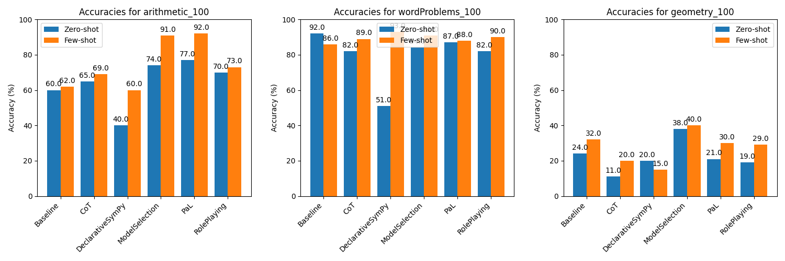

# Mathematical Capabilities of Large Language Models

This project aims to evaluate existing prompting and in-context learning techniques for LLMs on arithmetic skills and math word problem (MWP) solving capabilities. The focus is on arithmetic tasks that a 10-year-old pupil must be able to solve. For this purpose, we use [the dataset we created for arithmetic operations and MWPs](https://github.com/RamonKaspar/MathDataset-ElementarySchool) (sampled from existing datasets).

## Implementation of Multiple Techniques

For detailed information on how the various techniques are implemented, as well as instructions on how to add new techniques, please refer to the README in the `techniques` folder.

## Benchmark Dataset

### Arithmetic

We use the arithmetic dataset versions and `arithmetic_100.csv` and 100 samples. It was sampled from the [Math-401 (Yuan et al., 2023)](https://arxiv.org/abs/2304.02015) and the [Mathematics Dataset (Saxton et al., 2019)](https://openreview.net/pdf?id=H1gR5iR5FX) datasets. You can find more informations [here](https://github.com/RamonKaspar/MathDataset-ElementarySchool).

Here are an example from the dataset (in JSON format):

```json
{
  "category": "Arithmetic",
  "subcategory": "mul",
  "question": "Work out 5 * 354.",
  "answer": "1770.0",
  "reasoning": null,
  "source": "Mathematics Dataset (Google DeepMind)"
}
```

### Math Word Problems (MWP)

We use the word problems dataset versions `wordProblems_100.csv` with 100 samples. It was sampled from the [SVAMP (Patel et al., 2021)](https://arxiv.org/abs/2103.07191), [AddSub (Hosseini et al., 2014)](https://aclanthology.org/D14-1058/) and [MultiArith (Roy et al., 2016)](https://arxiv.org/abs/1608.01413) datasets. You can find more informations [here](https://github.com/RamonKaspar/MathDataset-ElementarySchool).

Here are an example from the dataset (in JSON format):

```json
{
  "category": "Word Problems",
  "subcategory": "add_sub",
  "question": "Jessica spent $ 10.22 on a cat toy , and a cage cost her $ 11.73 . What was the total cost of Jessica 's purchases ? ",
  "answer": 21.95,
  "reasoning": "X = 10.22 + 11.73",
  "source": "AddSub"
}
```

### Geometry

We use the word problems dataset versions `geometry_100.csv` with 100 samples. It was sampled from the [MathQA Geometry (Amini et al., 2019)](https://allenai.org/data/lila) dataset. You can find more informations [here](https://github.com/RamonKaspar/MathDataset-ElementarySchool).

Here are an example from the dataset (in JSON format):

```json
{
  "category": "Geometry",
  "subcategory": "geometry",
  "question": "a metallic sheet is of rectangular shape with dimensions 48 m x 36 m . from each of its corners , a square is cut off so as to make an open box . if the length of the square is 3 m , the volume of the box ( in m 3 ) is :",
  "answer": 3780.0,
  "reasoning": "n0 = 48.0\nn1 = 36.0\nn2 = 3.0\nn3 = 3.0\nt0 = n2 * 2.0\nt1 = n0 - t0\nt2 = n1 - t0\nanswer = n2 * t1 * t2\nprint(answer)",
  "source": "MathQA_Geometry"
}
```

## Evaluated Techniques

We distinguish between these two approaches:

- **Few-shot prompting**: refers to providing the model with a small number of examples (shots) before asking it to perform a task. These examples serve as a guide for how the task should be completed.
- **Zero-shot prompting** means the model is given a task without any prior examples. It relies solely on its pre-existing training to infer how to handle the task.

This table gives an overview of all techniques we evaluated. The column `Paper` cites the original source, and `Implementation` is the source of the implementation we used.

<table border="1" style="border-collapse: collapse; width: 100%;">
    <caption>Overview of the implemented and benchmarked techniques.</caption>
    <thead>
        <tr>
            <th><strong>Name</strong></th>
            <th><strong>Paper</strong></th>
            <th><strong>Implementation</strong></th>
            <th><strong>Description</strong></th>
        </tr>
    </thead>
    <tbody>
        <tr>
            <td>GPT-3.5-Turbo Baseline (<code>Baseline.py</code>)</a></td>
            <td>-</td>
            <td>Implemented on my own.</td>
            <td>Baseline with minimal instructions.</td>
        </tr>
        <tr>
            <td>Chain-of-Thought (<code>CoT.py</code>)</a></td>
            <td>J. Wei et al., “Chain-of-Thought Prompting Elicits Reasoning in Large Language Models.” arXiv, Jan. 10, 2023. Accessed: Mar. 22, 2024. [Online]. Available: http://arxiv.org/abs/2201.11903</td>
            <td>Implemented on my own.</td>
            <td>Method using LLMs to generate step-by-step textual reasoning chains for problem-solving.</td>
        </tr>
        <tr>
            <td>Program-aided Language Models (<code>PaL.py</code>)</a></td>
            <td>L. Gao et al., “PAL: Program-aided Language Models.” arXiv, Jan. 27, 2023. doi: 10.48550/arXiv.2211.10435.</td>
            <td><a href="https://github.com/reasoning-machines/pal">Author's implementation</a>(with slight adaptations)</td>
            <td>Method leveraging LLMs for generating programmatic reasoning steps in natural language problems, executed via a Python interpreter.</td>
        </tr>
        <tr>
            <td>Role-Play Prompting (<code>RolePlay.py</code>)</a></td>
            <td>A. Kong et al., “Better Zero-Shot Reasoning with Role-Play Prompting.” arXiv, Mar. 13, 2024. Accessed: May 03, 2024. [Online]. Available: http://arxiv.org/abs/2308.07702</td>
            <td><a href="https://github.com/NKU-HLT/Role-Play-Prompting">Author's implementation</a>(with slight adaptations)</td>
            <td>Role-play prompting involves instructing a language model to adopt a specific persona (i.e. a Math teacher) to tailor its responses accordingly.</td>
        </tr>
        <tr>
            <td>Declarative with SymPy (<code>DeclarativeSymPy.py</code>)</a></td>
            <td>J. He-Yueya, G. Poesia, R. E. Wang, and N. D. Goodman, “Solving Math Word Problems by Combining Language Models With Symbolic Solvers.” arXiv, Apr. 16, 2023. Accessed: May 02, 2024. [Online]. Available: http://arxiv.org/abs/2304.09102</td>
            <td><a href="https://github.com/joyheyueya/declarative-math-word-problem/tree/main">Author's implementation</a>(with slight adaptations)</td>
            <td>Uses the LLM to incrementally formalize problems into variables and equations, then employs a symbolic solver (Python SymPy) to compute solutions.</td>
        </tr>
        <tr>
            <td>Automatic Model Selection (<code>ModelSelection.py</code>)</a></td>
            <td>J. X. Zhao, Y. Xie, K. Kawaguchi, J. He, and M. Q. Xie, “Automatic Model Selection with Large Language Models for Reasoning.” arXiv, Oct. 23, 2023. doi: 10.48550/arXiv.2305.14333.</td>
            <td><a href="https://github.com/XuZhao0/Model-Selection-Reasoning/tree/main">Author's implementation</a>(with slight adaptations)</td>
            <td>Method for dynamic model selection between Chain-of-Thought (CoT) and Program-Aided Language Models (PAL) using LLMs, i.e. choose the most effective reasoning approach based on the problem specifics.</td>
</table>

## Evaluation

When the method directly returns a number (e.g., PaL, DeclarativeSymPy, ModelSelection), we use that value. Otherwise, we extract the last number in the LLM's response.

### Accuracy

The accuracy of each method across three benchmarks is displayed in the plot below. Each method was evaluated in both a zero-shot scenario and a few-shot scenario, the latter utilizing 5 example prompts.



The accuracies for the geometry dataset are significantly lower than those for the arithmetic and word problems, highlighting challenges specific to geometric reasoning.

### Which questions can be answered?

This section visualizes the performance of each method across three different datasets: `arithmetic_100`, `wordProblems_100`, and `geometry_100`, each containing 100 questions. The data is represented in three separate plots, one for each dataset. The grid layout within each plot allows for a visual comparison of the methods per question, effectively showing not only individual performance but also how the methods complement each other.


### The best method

We evaluate the methods based on three criteria:

- **Accuracy:** The overall accuracy should be as high as possible.
- **Latency:** Should be as low as possible.
- **Token Usage:** Use as few tokens as possible to reduce costs.

This plot gives an overview on the performance of each method:


The composite score for each technique is calculated as:

$$
\text{Score}_{\text{Technique}} = \alpha \cdot \text{Accuracy}_{\text{Technique}} + \beta \cdot \text{Normalized Latency}_{\text{Technique}} + \gamma \cdot \text{Normalized Token Usage}_{\text{Technique}}
$$

Normalization for Latency and Token Usage is performed using the following formula:
$$\text{Normalized Metric} = 1 - \frac{\text{Metric} - \min(\text{Metric})}{\max(\text{Metric}) - \min(\text{Metric})}$$
This normalization ensures that lower values, which are preferable, contribute positively to the overall score.

Weights are assigned based on the relative importance of each criterion: We choose $\alpha = 0.7$ for accuracy because providing correct answers is paramount. $\beta = 0.15$ and $\gamma = 0.15$ are assigned to latency and token usage respectively, reflecting their lesser but still significant roles in overall performance.

The resulting score represents the method's overall efficiency and effectiveness, making it easier to identify the most suitable techniques for practical applications in solving mathematical problems with LLMs.

To determine the best performing methods, we averaged the results from the three datasets (`arithmetic_100`, `wordProblems_100`, `geometry_100`).

| Technique                  | Accuracy | Mean Token usage | Mean Latency |    Score |
| :------------------------- | -------: | ---------------: | -----------: | -------: |
| PaL Few-shot               |      0.7 |          369.613 |      2.07205 | 0.732982 |
| RolePlaying Few-shot       |     0.64 |          200.403 |      1.02318 | 0.725959 |
| PaL Zero-shot              | 0.616667 |           108.69 |      1.80708 | 0.718163 |
| Baseline Zero-shot         | 0.586667 |          66.6517 |     0.921686 | 0.710667 |
| Baseline Few-shot          |      0.6 |           150.38 |      1.18518 | 0.704661 |
| RolePlaying Zero-shot      |     0.57 |          136.563 |      4.42511 | 0.660894 |
| CoT Few-shot               | 0.593333 |           425.51 |      3.91327 | 0.635244 |
| CoT Zero-shot              | 0.526667 |          113.805 |       4.9358 | 0.630243 |
| ModelSelection Few-shot    |     0.74 |          1010.36 |      6.35093 | 0.626167 |
| DeclarativeSymPy Few-shot  |     0.56 |          540.185 |      2.82096 | 0.602099 |
| ModelSelection Zero-shot   | 0.653333 |          347.842 |      20.3894 | 0.562639 |
| DeclarativeSymPy Zero-shot |     0.37 |           216.23 |      4.24902 | 0.509588 |
