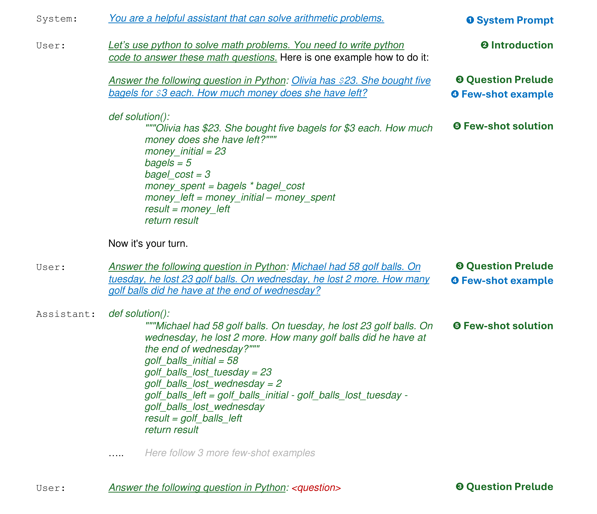

# Techniques

This folder contains implementations of various querying techniques used to evaluate large language models (LLMs) on different types of mathematical problems.

## Structure

Each technique is implemented in its own file within this folder. These are subclasses of the `TechniqueInterface` defined in `TechniqueInterface.py`.

To add a new technique:

1. Create a new Python file for your technique.
2. Define a class that inherits from `TechniqueInterface`.
3. Implement the `query`, `get_chat_introduction`, `get_question_prelude` and `get_few_shot_solutions` methods, providing the specific logic for your technique.

## Prompts

In order to maintain consistency across various techniques and ensure that direct comparisons are possible, we construct prompts using a standardized process detailed below. The prompt building is handled specifically by the `create_prompt_gpt35` method in the `util.py` file, tailored for GPT-based models. For other models, this function may require adjustments to fit different model specifications.

We tried to make this process as generic as possible, such that new techniques can be easily added.

We have designed this process to be as generic as possible to facilitate the seamless integration of new techniques.

The prompt construction consists of multiple components:

1. **System Prompt**: This is generally consistent across most methods, with a few exceptions like the Role-playing technique. You can find this prompt in the `shared_prompts.py` file, and it's shared across all techniques.

2. **Introduction**: This crucial component introduces the conversation, advising the LLM on approach strategies specific to the technique and dataset. Each technique implements its own introduction via the `get_chat_introduction` method.

3. **Question Prelude**: A brief lead-in to each question that clarifies to the LLM that a question is coming and briefly reminds it of the approach to use. This prelude is unique for each technique and is implemented via the `get_question_prelude` method.

4. **Few-shot Examples**: Consisting of five example tasks, these are standardized to ensure uniformity across all techniques and can be found in `shared_prompts.py`.

5. **Few-shot Solutions**: These are answers to the few-shot examples, vital for the technique's effectiveness, and are unique to each technique, implemented in the `get_few_shot_solutions` method.

6. **Question**: The actual question formulated for the LLM to respond.

Below is a visualization illustrating how a prompt is constructed. In this example, the technique is `PaL` and the dataset is `wordProblems`. Components shared across all techniques are marked in blue, found in `shared_prompts.py`. Technique-specific components are in green, and universally consistent elements are highlighted in black.

We distinguish between these two approaches:

- **Few-shot prompting**: refers to providing the model with a small number of examples (shots) before asking it to perform a task. These examples serve as a guide for how the task should be completed.
- **Zero-shot prompting** means the model is given a task without any prior examples. It relies solely on its pre-existing training to infer how to handle the task.

If the flag `few_shot_prompting` is enabled, then the shots are added to the conversation, else, we only add the system prompt, introduction, question prelude and the actual question.

## Shared Utilities

All techniques share common utilities defined in `util.py`. This file includes helper functions such as creating prompts, extracting solutions, running Python code snippets, etc. Be sure to make use of these utilities to avoid code duplication and maintain consistency across different implementations.

## Adding a New Technique

To integrate a new technique seamlessly:

1. Import necessary utilities from `util.py`.
2. Ensure your technique class complies with the interface contract established
